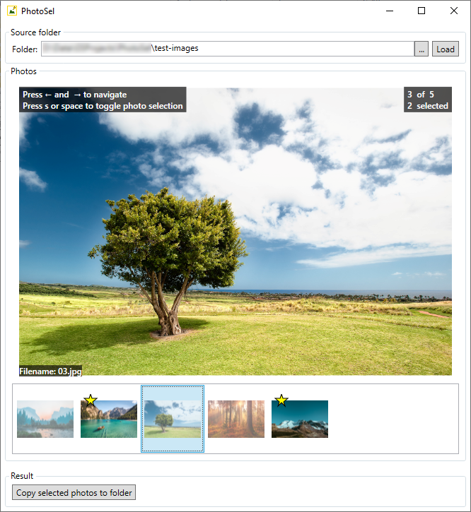

<h1>  PhotoSel</h1>

A tool to select images from a larger collection in a focused, fuss-free way.

## Usage

Enter the path which contains your image files or locate it using the folder browser (button *...*).
Click *Load* and browse the images with the arrow keys. Pressing *s* or the *space bar* will select (or de-select) the currently shown image. This is indicated by an orange border and the image is starred in the bottom list. Once you have selected the images you want to extract click on *Copy selected photos to folder* and navigate to the folder to which the selected photos should be copied.

The information which photos are selected is stored in the file *__photosel.txt* in the source folder along the image files. So it is retained even after closing the application. Once you re-load the same path the selection state of your photos will be restored. 
